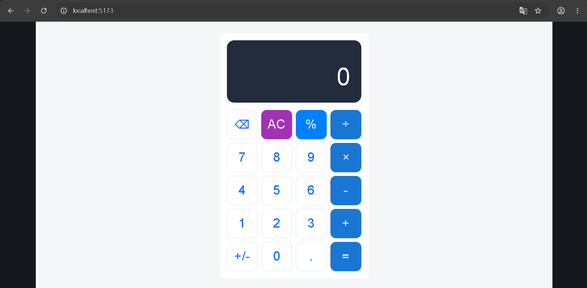
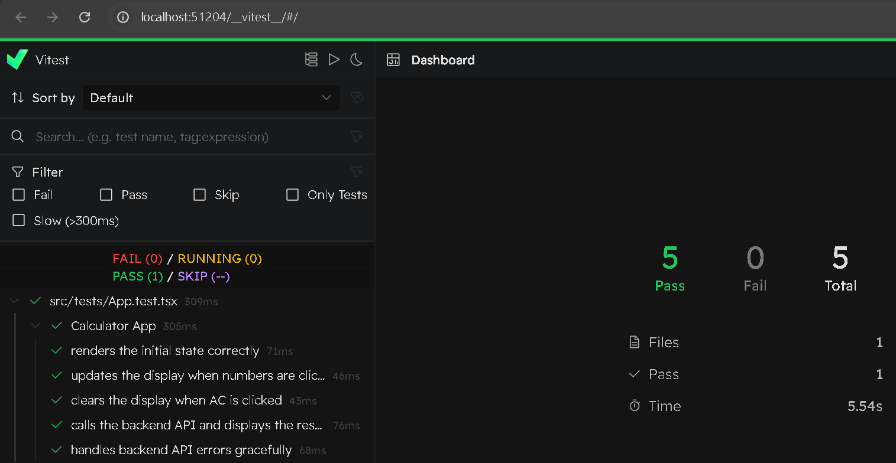
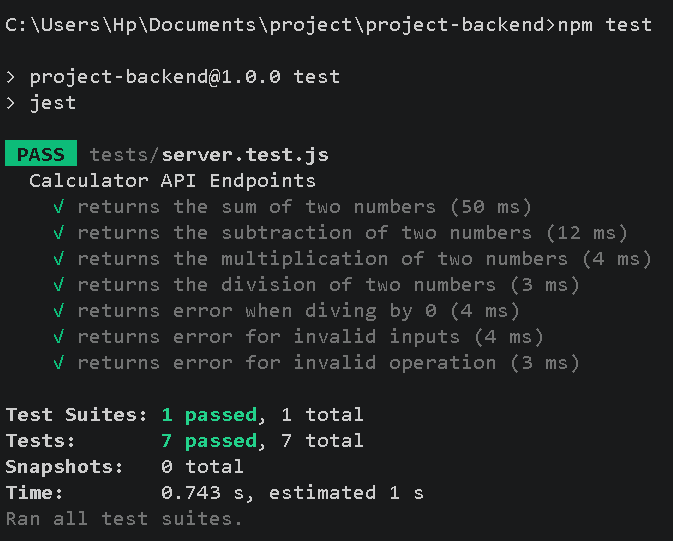

# Full-Stack Calculator Application

A modern, full-stack calculator web application built with a React frontend, Material UI styling, an Express.js backend API, and robust testing integration using Vitest.




## ✨ Features

* **Modern UI/UX:** Clean calculator layout styled with Material UI components and custom CSS.
* **Separation of Concerns:** Core arithmetic and edge-case validation handled securely by a stateless Node.js/Express backend.
* **Robust Testing:** Fully tested frontend components utilizing Vitest, Happy DOM, and React Testing Library.

---

## 🛠️ Tech Stack

* **Frontend:** React, TypeScript, Material UI, Vite
* **Backend:** Node.js, Express.js, CORS
* **Testing:** Vitest, Happy DOM, React Testing Library, Jest-DOM

---

## ⚙️ Setup Instructions

### Prerequisites

Make sure you have [Node.js](https://nodejs.org/) (LTS version) installed on your computer.

### 1. Clone or Open the Project

Open your terminal inside your project directory where both your frontend and backend folders reside.

### 2. Backend Setup

Navigate into your backend folder and install dependencies:

```bash
cd calculator-backend
npm install

```

### 3. Frontend Setup

Navigate into your frontend application folder (`project-app`) and install dependencies:

```bash
cd ../project-app
npm install

```

---

## 🚀 How to Run the Frontend and Backend

Because this is a decoupled architecture, you need to run both the backend server and the frontend development server concurrently in two separate terminal windows.

* **Terminal 1 (Backend Service):**
```bash
cd calculator-backend
npm run dev

```


*(The server will start and listen on `http://localhost:3000`)*
* **Terminal 2 (Frontend Client):**
```bash
cd project-app
npm run dev

```


*(Vite will spin up the local development URL, typically `http://localhost:5173`)*

---

## 🧪 Running the Tests

The frontend uses **Vitest** paired with **Happy DOM** for blazing-fast component and behavior testing without a heavy browser instance.

To run the test suite, navigate to your frontend folder (`project-app`) and run:

```bash
npm run test

```

* **UI Mode:** To interact with tests visually in your browser, run:
```bash
npm run test:ui

```


---

## 🔌 API Documentation (REST Endpoints)

The backend exposes a single POST endpoint to compute arithmetic safely away from the client.

### `POST /api/calculate`

* **Content-Type:** `application/json`
* **Request Body Schema:**
```json
{
  "operand1": 10,
  "operand2": 5,
  "operation": "add"
}

```


*(Allowed operations: `"add"`, `"subtract"`, `"multiply"`, `"divide"`)*

#### Example cURL Request:

```bash
curl -X POST http://localhost:3000/api/calculate \
-H "Content-Type: application/json" \
-d '{"operand1": 10, "operand2": 5, "operation": "add"}'

```

#### Successful Response (`200 OK`):

```json
{
  "result": 15
}

```

#### Error Response Example (Division by Zero - `400 Bad Request`):

```json
{
  "error": "Math Error: Cannot divide by zero."
}

```

---

## ✅ Front-end tests


## ✅ Back-end tests


## 💡 Design Decisions & Assumptions

1. **Stateless Backend Architecture:** The backend API does not retain memory of previous inputs or ongoing calculations. The frontend manages the UI state and sends the completed operands and operation to the server upon hitting `=`.
2. **Floating-Point Precision Fix:** JavaScript engine math quirks (e.g., `0.1 + 0.2 = 0.30000000000000004`) are mitigated on the backend using rounding protocols prior to returning JSON payloads.
3. **Strict Input Validation:** The backend explicitly validates that incoming payloads contain finite numbers and whitelisted operation types to prevent unexpected server execution behavior.
